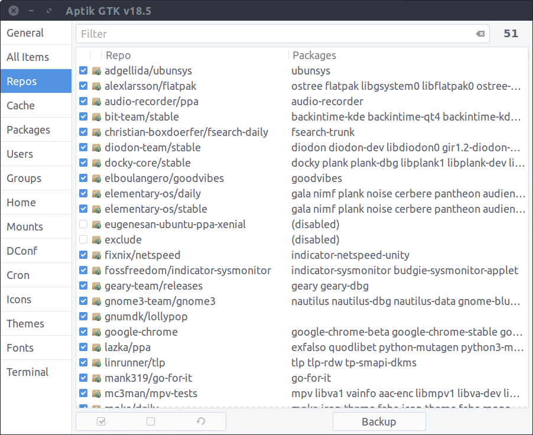
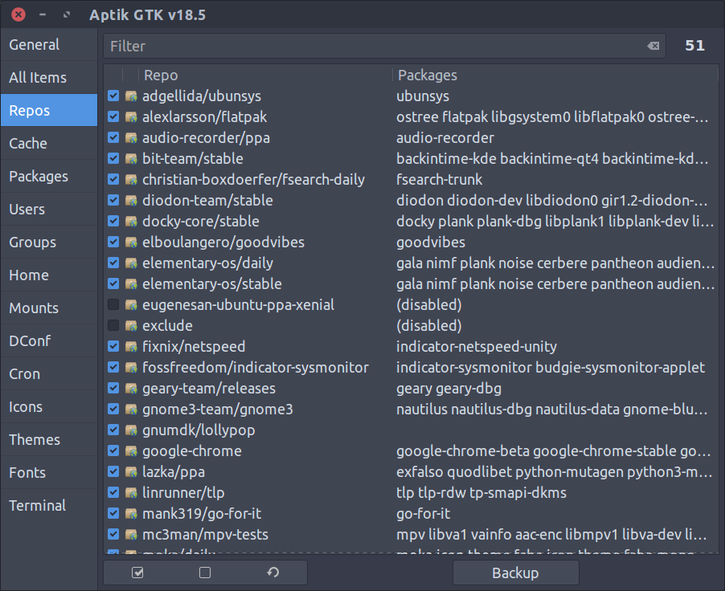

## Aptik GTK

Aptik GTK is a GTK frontend for the [Aptik System Migration Utility](https://github.com/teejee2008/aptik).

Aptik is a tool for **migrating settings and data** from one Linux installation to another. It can be used while re-installing the operating system, and when moving to next release of a Linux distribution.


## Screenshots






## Installation

PPA and DEB files are available for Ubuntu and Ubuntu-based distributions. Binary installers are available for all Linux distributions.

**[Installation](https://github.com/teejee2008/aptik/wiki/Installation)**

## Donate

Aptik includes a few extra plugins for people who have contributed to the project through donations, translations, etc. You can make a donation for $10 or more via PayPal to receive the plugins by email. Your contributions will help keep the project alive and support future development.

**PayPal** ~ If you find this application useful and wish to say thanks, you can buy me a coffee by making a one-time donation with Paypal. 

[](https://www.paypal.com/cgi-bin/webscr?business=teejeetech@gmail.com&cmd=_xclick&currency_code=USD&amount=10&item_name=Aptik%20Donation)  

**Patreon** ~ You can also sign up as a sponsor on Patreon.com. As a patron you will get access to beta releases of new applications that I'm working on. You will also get news and updates about new features that are not published elsewhere.

[](https://www.patreon.com/bePatron?u=3059450)

**Bitcoin** ~ You can send bitcoins at this address or by scanning the QR code below:

```1Js5vfgmwKew4byF9unWacwAjBQVvZ3Fev```


